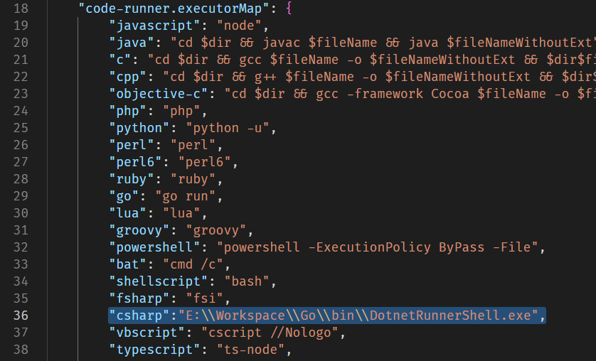

# DotnetRunnerShell

一个实用小工具，功能是输入 `DotnetRunnerShell <path_to_entry.cs>` 后，可以使用 dotnet CLI 执行入口文件所在的工程。

---
## 动机

写这个小东西的动机在于使用 VS Code 写 C# 时，Code Runner 插件默认会调用 `scriptcs` 来执行代码。但 `scriptcs` 似乎与本项目不同，并不只是一个单纯调用 CLR 执行 C# 程序的工具，其在遇到一些新特性时不能很好处理（e.g. File-scoped Namespaces，文件范围的命名空间）而会报错。因此，为了满足自己 **只是想按下运行键就能运行** 的单纯需求，就写了这个小程序。

> 这个程序原理很简单，没有什么技术含量，稍微了解一门语言就能写出来。开源也单纯是存一下档，下次换环境的时候可以直接拿来用。

---
## 使用方法
在 VS Code 中打开 Code Runner 扩展的设置，点击 Executor Map ，跳转到 settings.json 文件中编辑。将 `csharp` 对应的设置更改为 DotnetRunnerShell 的存放路径即可。如下图所示：

